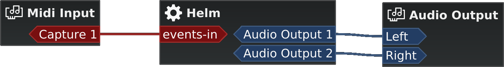

Carla is by design a modular audio plugin host.
This means it will load audio plugins in a modular rather, where each plugin is a module inside a patchbay and you can connect between them and your hardware in order to send signals to the plugins and/or have them generate sound.

In a modular host, the simplest way to achieve sound is by using "generators" (something that either generates sound by itself, or based on user input).

Here is an example of a MIDI keyboard connected to a synth, which is then connected to the output speakers:

==== Control Voltage

In modular hosts it is common to have CV (Control Voltage) signals.

These are similar to audio, in that they stream at regular intervals (contrary to events which only happen at specific points in time).
CV are a good option for parameters that require very precise and fast control, as they provide infinite precision (CV changes are sample-accurate and not limited to a specific amount of steps)

==== Carla specifics

In Carla, audio and CV connections have blue color, while events (including MIDI) have red color.
Events are merged into a single port, while audio and CV are separate. For example, stereo audio output consists of 2 independent audio ports.

Audio ports can be patched at will, from any port to any port.
CV is treated similar to audio (because technically it really is), but you are not allowed to connect audio and CV ports together, for safety reasons.
Audio and CV ports are constantly streaming data from one side to the other.
An audio port streams data for a single mono audio channel, while a CV port streams data for a single control/parameter.

Event ports transmit events when they happen (for example, pressing a key on a MIDI keyboard).
All of MIDI and OSC related events are bundled together in a single event port.

==== Engine modes

There are 4 types of engine processing modes in Carla:

- Single-client: (JACK driver only)
    Same as Multi-client, except that all JACK ports belong to a single master client.
    This is needed when a setup doesn't support multi-client JACK apps, such as LADISH.

- Multi-client: (JACK driver only)
    Every single plugin is exposed as a new JACK client. Audio, CV and event ports are registered as needed.

- Continuous Rack:
    Plugins are processed in order, from top to bottom.

- Patchbay:
    Modular patchbay mode, just like in JACK Multi-client and many other modular applications.
    Every plugin gets its own canvas group and ports allowing you to interconnect plugin audio, cv and event ports.
