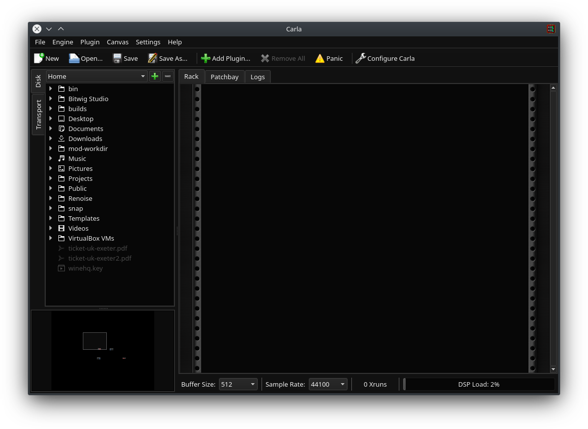

=== Main Window

When you run Carla you'll be presented with this window:

You can see some familiar elements from other applications, like the menu-bar and tool-bar.
Then you have a side-panel where you will find an integrated filesystem browser (with user bookmarks) and transport controls.

The bigger central area is the working space.
Here you find the "Rack" where all plugin instances will be shown, the "Patchbay" where you can make connections between the plugins and hardware, and "Logs" where debug or warning messages are logged.

Please note that, under some systems or circunstances, these tabs will not be present.
When Carla runs as a plugin or under Windows platform, the "Logs" is not visible.
And when Carla runs as "Carla-Rack" plugin, the "Patchbay" tab is not shown.

The toolbar buttons can also be different depending on the occasion.
For example, "Save" is not available when running as a plugin, since it is the host responsibility to do that instead.

==== Menus

===== File

In the file menu you can start your project/session from scratch, open existing ones, save and quit/close Carla.

==== Engine

In the engine menu you have the chance to start and stop the audio engine.

In the future it is planned to add a direct shortcut to engine settings here.

==== Plugin

In the plugin menu is where you find the action to add new plugins into the session.
You can also remove all plugins from this menu, and trigger a few action to all of them at once (for convenience).

==== Canvas

In the canvas menu you find options related to the patchbay canvas view.
These are to refresh, set zoom level and export the canvas as an image.

When running Carla's engine in "Patchbay" mode, you will also find here a "Show Internal" and "Show External" switch.
This allows to connect the internal patchbay graph into external devices, such as MIDI keyboards and other JACK clients.
Using the "Show External" switch is how you usually will setup your MIDI devices.

==== Settings

In the settings menu you can find the action to open Carla's settings, as well as a few on/off switches for what to show on screen.
By default everything is visible, but you can hide stuff if you prefer.

==== About

In the about menu you can open Carla's about dialog.

In the future it is planned to have useful links here.
